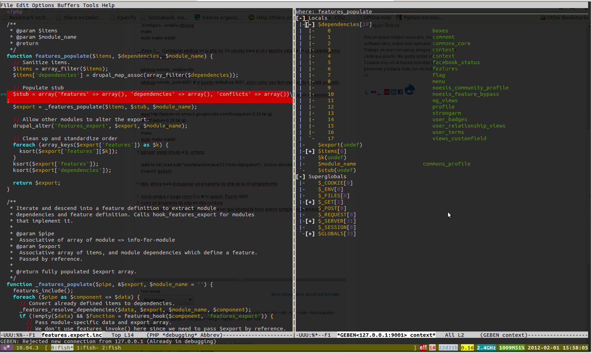

Una de las cosas más útiles que puedes aprender para debuguear un programa en PHP es a usar [xdebug](http://www.xdebug.org/). Y la verdad no es nada complicado.

**Paso 1**. Instalar xdebug. Eso lo puedes hacer con un simple `sudo apt-get install php5-xdebug`. Lo malo es que en ubuntu 10.04 (nuestros servers de prueba) se instala una versión viejita. Se necesita la versión 2.1 para que funcionen cosas padres como inspeccionar variables. Instalarlo en ubuntu tampoco es difícil.

    cd ~
    sudo apt-get install php5-dev
    wget http://www.xdebug.org/files/xdebug-2.1.3.tgz
    tar -xzf xdebug-2.1.3.tgz
    cd xdebug-2.1.3
    phpize
    ./configure --enable-xdebug
    make
    sudo make install
    

**Paso 2**. Configurar xdebug en tu php.ini. En ubuntu para el cli y apache esto es en una carpeta como `/etc/php5/cli/php.ini`:

    xdebug.remote_enable=On
    xdebug.remote_autostart=On
    xdebug.remote_port=9001 # el puerto default es 9001, pero como uso fpm ese puerto ya está ocupado
    

**Paso 3**. Instalar un cliente para xdebug como geben para emacs (lo puedo usar en mi servidor directamente). Estoy suponiendo que ya tienes emacs instalado:

    wget http://geben-on-emacs.googlecode.com/files/geben-0.26.tar.gz
    tar xzf geben-0.26.tar.gz
    cd geben-0.26
    make
    sudo make install
    

Y agregar estas líneas a tu .emacs:

    (add-to-list 'load-path "/usr/share/emacs/23.1/site-lisp/geben") ; Geben directory
    (require 'geben)
    

Y listo, ahora para debuguear un programa de php de tu cli simplemente:

1.  inicia emacs y luego corre C-u M-x geben. Puerto 9001.
2.  corre un programa de php en otra consola
3.  utiliza geben en todo su esplendor. Para ver qué shortucts tiene geben simplemente presiona '?'

**Cuidado!!!** No lo uses en tu servidor de producción, porque el desempeño baja considerablemente.

### Referencias:

*   [http://ocdevel.com/blog/xdebug-geben-emacs-php-ubuntu-104](http://ocdevel.com/blog/xdebug-geben-emacs-php-ubuntu-104)
*   [http://blog.abourget.net/2010/9/13/geben-+-emacs-+-ubuntu-and-make-the-d...](http://blog.abourget.net/2010/9/13/geben-+-emacs-+-ubuntu-and-make-the-debugging-work/)
*   [http://code.google.com/p/geben-on-emacs/source/browse/trunk/geben.el?r=119](http://code.google.com/p/geben-on-emacs/source/browse/trunk/geben.el?r=119)